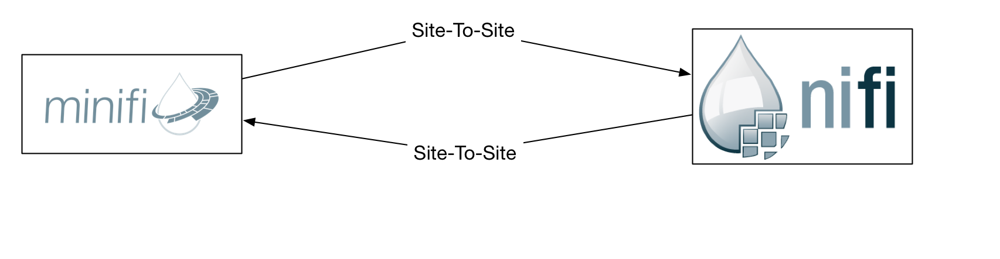
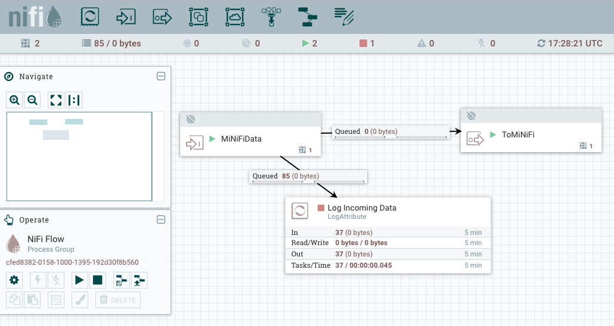
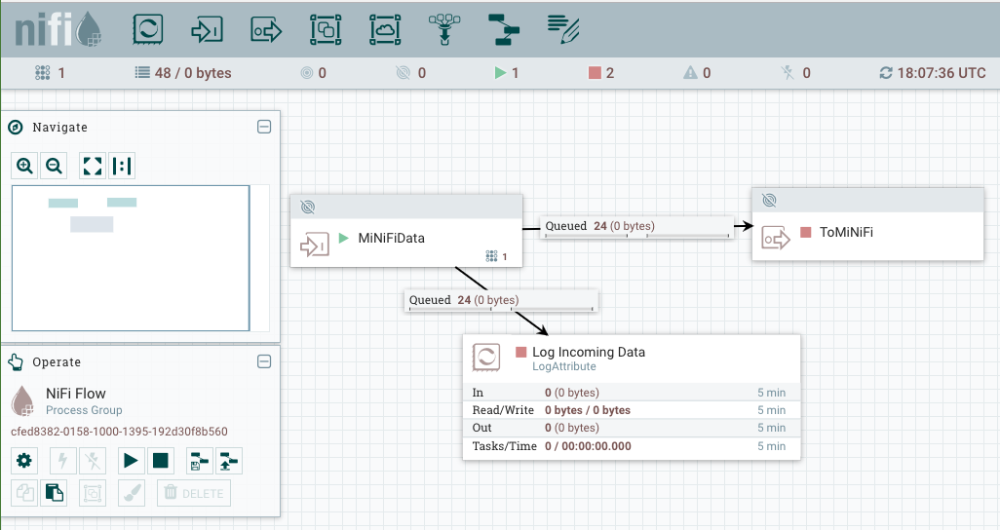
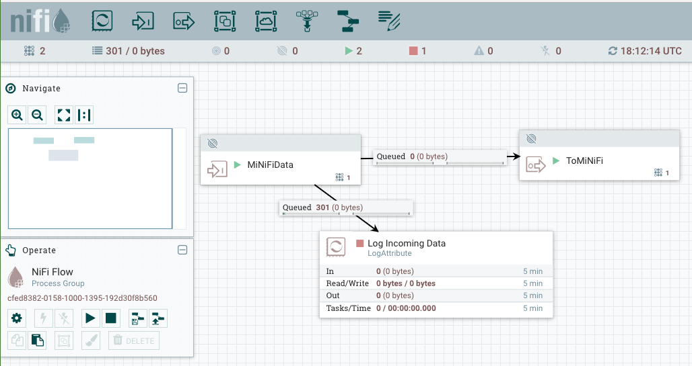

<!--
  Licensed to the Apache Software Foundation (ASF) under one or more
  contributor license agreements.  See the NOTICE file distributed with
  this work for additional information regarding copyright ownership.
  The ASF licenses this file to You under the Apache License, Version 2.0
  (the "License"); you may not use this file except in compliance with
  the License.  You may obtain a copy of the License at
      http://www.apache.org/licenses/LICENSE-2.0
  Unless required by applicable law or agreed to in writing, software
  distributed under the License is distributed on an "AS IS" BASIS,
  WITHOUT WARRANTIES OR CONDITIONS OF ANY KIND, either express or implied.
  See the License for the specific language governing permissions and
  limitations under the License.
-->
# Bidirectional Site-To-Site Configuration

## Overview

Site-To-Site is a cornerstone feature to the Apache NiFi platform. Currently configuring Site-To-Site with MiNiFi-CPP can be a little tricky however. There are plans in the roadmap to improve this configuration flow but given what we have today this example will demonstrate how you can configure Apache MiNiFi-C++ for bidirectional communication with Apache NiFi.

Below is a very high level diagram illustrating our end goal in this example.



## Apache NiFi Setup

Before we start setting up our MiNiFi-CPP instance we need to first setup our Apache NiFi instance that the MiNiFi instance will be communicating with. If we recall from the deployment diagram above our example will have a simple environment consisting of a single NiFi instance. While we are using a small environment here the same principals would apply for larger deployments.

First we must [download and install NiFi](https://nifi.apache.org/docs/nifi-docs/html/getting-started.html#downloading-and-installing-nifi) if you haven't done so already.

As you can see from the screenshot below our contrived NiFi workflow example simply accepts data from MiNiFi, logs that data, and also writes that data back to MiNiFi. 



You can download this workflow from the screenshot [here](assets/BidirectionalSite2SiteExample.xml)

After installing NiFi, uploading the workflow, and ensuring site-to-site is enabled there are a few environment specific values that you should take note of as you will need them when configuring MiNiFi.

- ```{NIFI_HOST_OR_IP}``` - The hostname or IP of your NiFi and MiNiFi instances.
  - ```nifi.dev``` and ```minifi.dev``` are the hostnames for this example instance but your instance will vary.
- ```{NIFI_OUTPUT_PORT_ID}``` and ```{NIFI_INPUT_PORT_ID}``` - The ID of the Input and Output ports from your NiFi workflow.
  - Even if you download and use the same workflow from [here](assets/BidirectionalSite2SiteExample.xml) these ID values are autogenerated and will be different in your environment.
  - You can find these values by highlighting the Input or Output port in the NiFi workflow and copying the ID value from the ```Operate``` tile in the NiFi UI.
- ```{NIFI_SITE_TO_SITE_PORT}``` - Ensure Apache NiFi site-to-site is enabled by following [this guide](https://nifi.apache.org/docs/nifi-docs/html/administration-guide.html#site_to_site_properties). Note the port you specify for ```nifi.remote.input.socket.port```

## Apache MiNiFi-CPP Setup

Setup for the MiNiFi instance really only involves properly configuring your flow yml file which by default is located at ```$MINIFI_HOME/conf/config.yml```. The below configuration can be used after replacing the ```{}``` values with those called out above in the NiFi configuration. After updating this config.yml it can be placed in your ```$MINIFI_HOME/conf/config.yml``` and then MiNiFi can be restarted. After restarting MiNiFi you should start seeing flowfiles accumulate in the output connection from the ```MiNiFiData``` input port in your NiFi UI when you place or touch a file in the directory ```/tmp/getfile/``` on the MiNiFi host.

```
Flow Controller:
    name: MiNiFi Bidirectional SiteToSite Example

Processors:
    - name: GetFile
      class: org.apache.nifi.processors.standard.GetFile
      max concurrent tasks: 1
      scheduling strategy: TIMER_DRIVEN
      scheduling period: 1 sec
      penalization period: 30 sec
      yield period: 1 sec
      run duration nanos: 0
      auto-terminated relationships list:
      Properties:
          Input Directory: /tmp/getfile
          Keep Source File: true

Connections:
    - name: TransferFilesToRPG
      source name: GetFile
      source relationship name: success
      destination name: {NIFI_INPUT_PORT_ID}
      max work queue size: 0
      max work queue data size: 1 MB
      flowfile expiration: 60 sec

Remote Processing Groups:
    - name: NiFi Flow
      url: http://{NIFI_HOST_OR_IP}:{NIFI_WEB_UI_PORT}/nifi
      timeout: 30 secs
      yield period: 10 sec
      Input Ports:
          - id: {NIFI_INPUT_PORT_ID}
            name: MiNiFiData
            max concurrent tasks: 1
            Properties:
                Port: {NIFI_SITE_TO_SITE_PORT}
                Host Name: {NIFI_HOST_OR_IP}
      Output Ports:
          - id: {NIFI_OUTPUT_PORT_ID}
            name: ToMiNiFi
            max concurrent tasks: 1
            Properties:
                Port: {NIFI_SITE_TO_SITE_PORT}
                Host Name: {NIFI_HOST_OR_IP}
```

## Conclusion

After starting MiNiFi we can see that the connections going to both ```LogAttribute``` and ```ToMiNiFi``` both contain 24 flowfiles. Since both of the processors are stopped this makes perfect sense and validates that the data is flowing from MiNiFi to NiFi as expected. 



Now to validate that the flowfiles will flow back to MiNiFi we can start the ```ToMiNiFi``` output port and the connection queue should drain its flowfiles. 



As you can see from the screenshot after starting ```ToMiNiFi``` the connection successfully drained and the flowfiles were successfully transfered back to MiNiFi completing the bidirectional lifecycle.